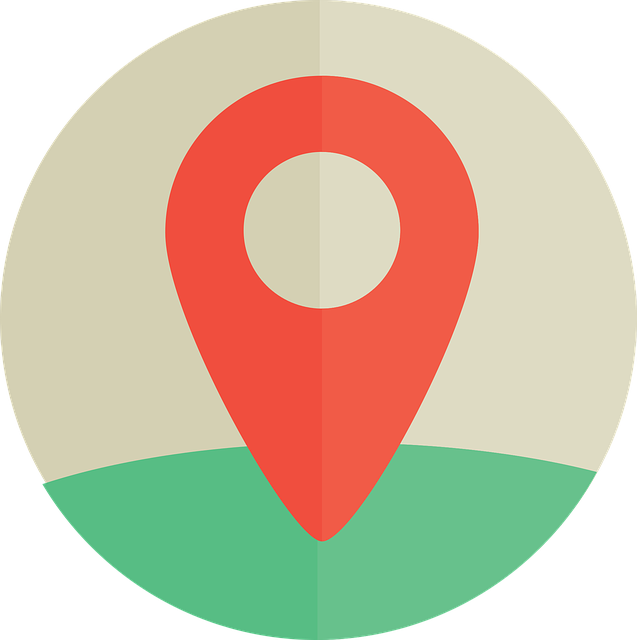

# GpsTracker - GPS Tracking Module

GPS tracking system for receiving and managing GPS location data from mobile devices and trackers.

## Description

The `GpsTracker` module provides GPS tracking capabilities for the osysHome platform. It supports uLogger protocol and provides API endpoints for receiving GPS coordinates from mobile devices.

## Main Features

- ✅ **GPS Tracking**: Receive GPS coordinates from devices
- ✅ **uLogger Support**: Compatible with uLogger protocol
- ✅ **Device Management**: Manage multiple GPS devices
- ✅ **Location History**: Store location history
- ✅ **Distance Calculation**: Calculate distance from home location
- ✅ **API Endpoints**: RESTful API for GPS data

## Admin Panel

The module provides an admin interface for:
- Viewing GPS devices
- Viewing location history
- Managing devices

## API

The module provides API endpoints:
- **POST /client/index.php**: uLogger-compatible endpoint
- **GET /api/GpsTracker/...**: RESTful API endpoints

## Supported Protocols

- **uLogger**: Standard uLogger protocol for GPS tracking apps

## Usage

### Receiving GPS Data

1. Configure GPS tracking app (e.g., uLogger)
2. Set endpoint URL: `http://your-server/GpsTracker/client/index.php`
3. Authenticate with username
4. GPS data received automatically

## Technical Details

- **Protocol**: uLogger-compatible HTTP POST
- **Data Storage**: Database storage for locations
- **Distance Calculation**: Haversine formula for distance
- **Home Detection**: Automatic home location detection

## Version

Current version: **0.1**

## Category

App

## Requirements

- Flask
- SQLAlchemy
- osysHome core system

## Author

Eraser

## License

See the main osysHome project license

